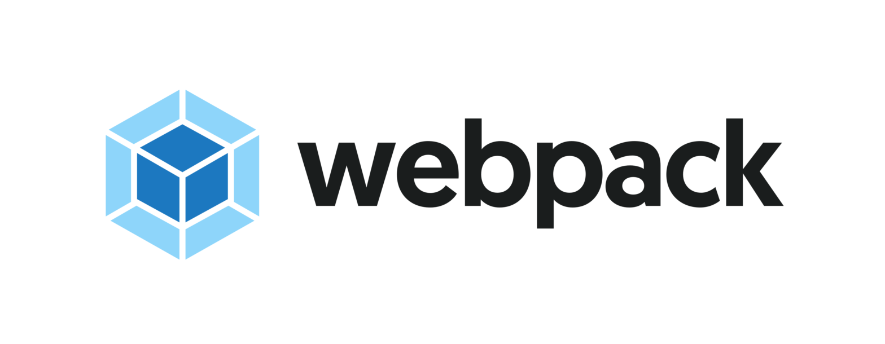

<!-- Logotipo -->
<h1 align="center" style="padding: 50px;">

</h1>

<div align="center">

<!-- Badges -->


<!-- Menu -->
<p align="center" >
  <a href="#bookmark_tabs-about-the-project">:bookmark_tabs:&nbsp;&nbsp;About the project</a>&nbsp;&nbsp;&nbsp;|&nbsp;&nbsp;&nbsp;
  <a href="#rocket-technologies">:rocket:&nbsp;&nbsp;Technologies</a>&nbsp;&nbsp;&nbsp;|&nbsp;&nbsp;&nbsp;
  <a href="#information_source-how-to-use">:information_source:&nbsp;&nbsp;How To Use</a>
</p>

</div>

<!-- About -->
## :bookmark_tabs: About the project

This is webpack configuration

<!-- Technologies -->
## :rocket: Technologies

- [Webpack](https://webpack.js.org/)
- [Webpack CLI](https://www.npmjs.com/package/webpack-cli)
- [Html Webpack Plugin](https://webpack.js.org/plugins/html-webpack-plugin/)
- [Babel Loader](https://www.npmjs.com/package/babel-loader)
- [@babel/core](https://www.npmjs.com/package/@babel/core)
- [@babel/preset-env](https://www.npmjs.com/package/@babel/preset-env)
- [Jest](https://jestjs.io/)


<!-- How to use -->
## :information_source: How To Use


To clone and run this application, you'll need [Git](https://git-scm.com), [Node.js v10.16](https://nodejs.org/en) or higher + [Yarn v1.13](https://yarnpkg.com) or higher installed on your computer. Run from your command line:

```bash
# Clone this repository
$ git clone git@github.com:KaiqueCovo/WebpackConfig.git

# Go into the repository
$ cd WebpackConfig

# Install dependencies
$ yarn install
# or
$ npm install

# Build production project
$ yarn production

# Build development project
$ yarn development
```

---
Made with ♥  by [Kaique Covo](https://www.linkedin.com/in/kaique-covo-a46331147/) :wave:
